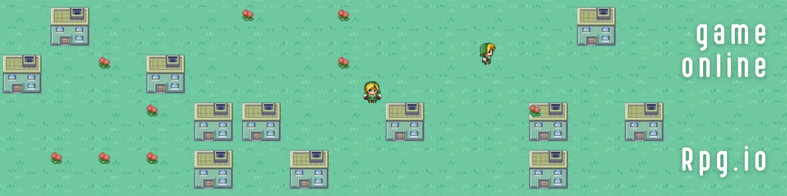

# rpg.io





## :video_game: Descriptif

**Rpg.io** est un concept de monde ou vous pouvez vous connecter à plusieurs et vous déplacer librement sur une carte.  

J'ai créé ce projet pour expérimenter sur le real-time	:hourglass: avec socket.io et travailler l'aspect visuel grâce au canvas :paintbrush: fourni par HTML5.

## Installation

### Node
  1. Télécharger la version LTS de NodeJS [ici](https://nodejs.org/fr/download/)
  2. Suivre les étapes d'installation en laissant les options par défaut.

Version de Node v18.1.0


## Utilisation

1. Ouvrir une invite de commande à la racine du projet
2. S'assurer d'avoir les dépendances npm installées 
```
npm install
```
3. Exécuter 
```
npm start
```
 
Puis :
4. Ouvrir un navigateur à l'adresse [http://localhost:3000/](http://localhost:3000/)

